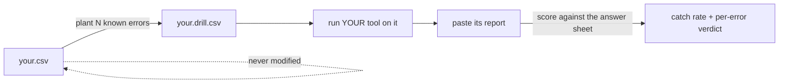

# data-error-drill

**[中文说明 →](README.zh-CN.md)**

> **Can it catch?**

  

Is your AI quietly cutting corners — results that look tailored, logic that slacks off?

You had it build a data-checking tool. It says "no issues found" every time; then the data shifts, and the numbers come out wrong. Don't guess. This tool preps an exam in advance: plant a few known errors into a copy of your table — flip a digit, drop a row, shift a date's month — and see at a glance which ones your tool misses:



Everything runs in your browser. No install, no upload, no account.

**[▶ Try it now](https://chutinaa.github.io/data-error-drill/)** · **[▶ See a scored example (demo mode)](https://chutinaa.github.io/data-error-drill/?demo=1)**


## Contents

1. [Why](#1-why)
2. [Try it (30 seconds)](#2-try-it)
3. [The nine planted errors](#3-the-nine-planted-errors)
4. [How scoring works — and what it proves](#4-how-scoring-works)
5. [Let an AI design your drill](#5-let-an-ai-design-your-drill)
6. [The research behind it](#6-the-research-behind-it)
7. [For developers](#7-for-developers)
8. [Data policy](#8-data-policy)

## 1. Why

Tools built by non-engineers rarely get tested — they get *trusted*, right up until real data embarrasses them. You don't need a QA team to fix that. You need one honest question: **if this file contained a known error, would my tool report it?** This project makes that question take two minutes to answer.

Engineers have done this to their code for decades — it's called [mutation testing](https://en.wikipedia.org/wiki/Mutation_testing). This is the same idea for the data side, packaged so a business user can run it out of the box.

**This is not a data-validation tool.** It tests your AI tool, not your data. AI-generated logic can look right and still be wrong: the report reads confidently while the code underneath cuts corners and never runs the checks you asked for (the failure mode people call *hallucination*). The test is direct: plant a few traps in a copy of your data and see whether your tool reports them. If it does, it's really working. If it doesn't, you've just caught it slacking.

## 2. Try it

1. Open the [web version](https://chutinaa.github.io/data-error-drill/) and click **Load sample** (or drop your own `.csv` — first row must be the header).
2. Tick the error types to plant, set counts, hit **Generate drilled copy**.

   

3. Download `<name>.drill.csv`, run **your** tool on it.
4. Paste your tool's report into step 4 and hit **Score it**: catch rate, per-fault verdicts, evidence.

The answer sheet (`.answers.json`) records every planted fault — type, row, column, before/after — and can restore the original file byte for byte. Don't peek before scoring.

## 3. The nine planted errors

Each error type simulates a documented real-world failure, and each has a known cheapest defense — that pairing is the whole game: **what your tool misses tells you exactly which check to add.**

| Planted error | Simulates | Typically caught by |
|---|---|---|
| Flip one digit | hand-copy typo, OCR misread | totals / reconciliation |
| Swap two adjacent digits | the classic keying transposition (402.75 → 420.75) | totals — range checks usually pass ⚠️ |
| Shift the decimal point | unit/scale mixup, ×10 or ÷10 | magnitude & range checks |
| Blank out a cell | unmapped field, formula returning empty | completeness checks |
| Delete a row | export filter left on, lost paste | row-count / sum reconciliation |
| Duplicate a row | double submission, join fan-out | duplicate checks |
| Shift a date's month | stale formula, format mixup | period/window checks |
| Sneak in a plausible wrong value | wrong status picked, copy from wrong row | **only** cross-checks — format checks all pass ⚠️ |
| Add invisible whitespace | copy-paste residue that breaks joins silently | trimmed-match / join reconciliation ⚠️ |

The ⚠️ rows are the ones most tools miss — they *look* valid. That's why they exist here.

## 4. How scoring works

Scoring is **evidence-based**: a fault counts as caught if your tool's report mentions the planted wrong value or the affected row's key. That is evidence, not proof — a report could name a row for the wrong reason. And one green run is a data point, not a certificate: re-run with a different seed or fault mix before you relax.

False alarms (your tool flagging things that weren't planted) are not scored in v0.1 — read your tool's report yourself for those.

## 5. Let an AI design your drill

Random errors are a fine start; *predicted* errors are a better drill. [`skill/SKILL.md`](skill/SKILL.md) teaches any AI assistant to:

1. **triage your table** — find the columns that feed final computed indicators, where errors hide longest;
2. **map your tool's blind spots** — from one sentence about what it checks;
3. **predict which planted errors it will miss** — then the drill confirms or refutes the prediction;
4. **turn every confirmed miss into the cheapest check** that would have caught it.

Paste the file into any AI chat together with your header row. No code needed.

## 6. The research behind it

The design borrows three results from decades of testing research, so the drill stays small without getting weaker:

- **Selective mutation** (Offutt et al., 1996): a few well-chosen error operators expose about as much as exhaustive ones. That's why there are nine fault types, not ninety — each maps to a documented real-world failure class.
- **The coupling effect** (DeMillo et al.): tests that catch simple single faults tend to catch the messier compound faults they compose into. That's why every drill plants errors that each change one thing, never stacked on top of each other.
- **Spreadsheet error research** (Panko / EuSpRIG): the errors that survive longest in real spreadsheets are the plausible-looking ones — valid-format wrong values and silent omissions. That's exactly what `value-swap`, `key-space` and `row-drop` plant.

## 7. For developers

```
engine/mutate.js    zero-dependency fault engine (browser / bun), seeded & reversible
engine/score.js     evidence-based report scorer
faults/*.json       fault type metadata
index.html          the whole UI, single file
```

`bun test` runs the suite. The invariant that matters: every answer sheet must restore the mutated table to the original, byte for byte — tested across 50 seeds and all nine fault types. `?demo=1` auto-runs the full loop on the sample.

## 8. Data policy

All sample data is fictional. Your files are processed entirely in your browser and never leave your machine. The drilled copy and answer sheet download straight from page memory.

MIT licensed.

Questions or bugs? [Open an issue](../../issues).
