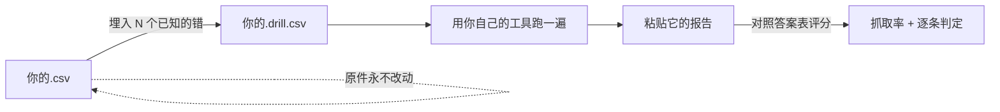
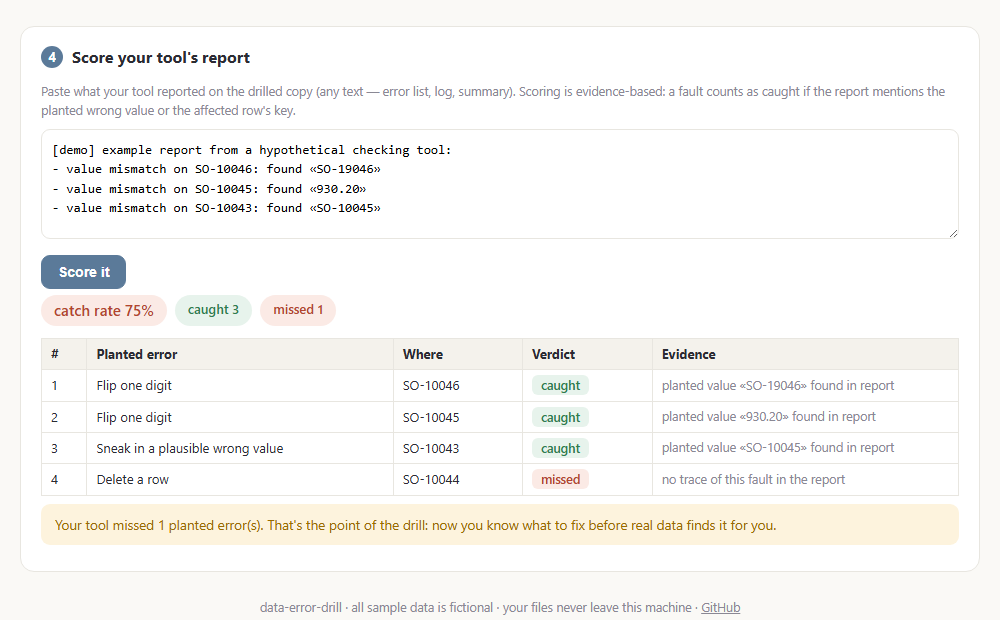
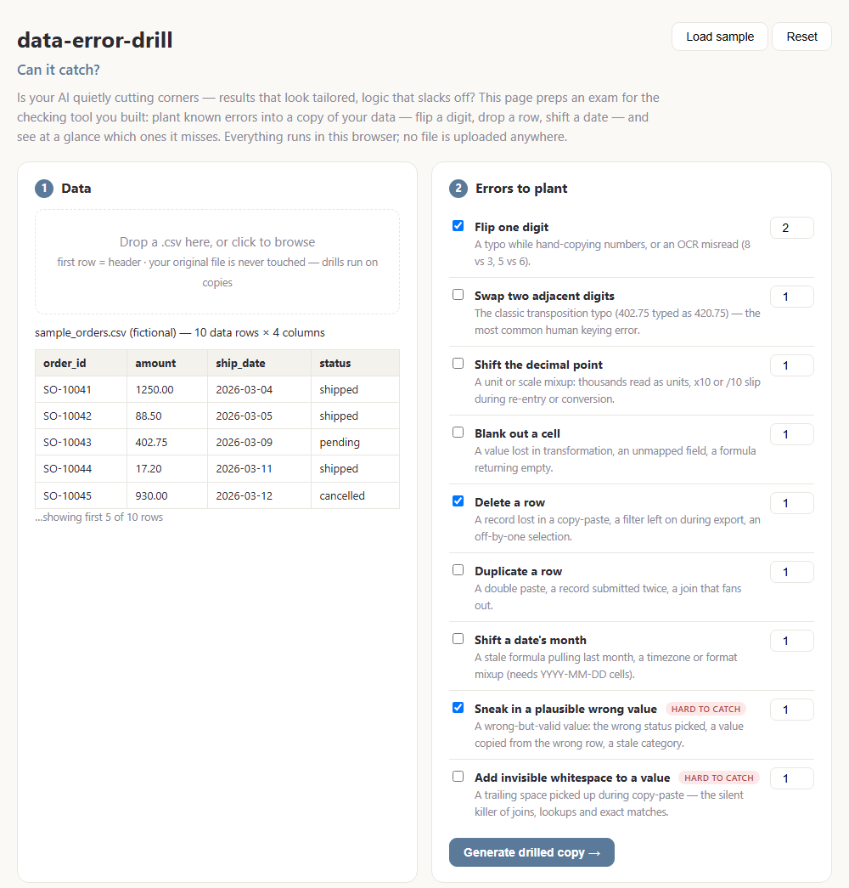

# data-error-drill

**[English →](README.md)**

> **你的工具，抓得住吗？**

  

你的 AI 会不会在骗你？——结果看着量身定制，逻辑其实在偷懒。

你让它做了个核对数据的工具，它每次都说"没发现问题"；可数据一变，计算就出错。别猜。这个工具提前帮你出一套"考题"：往表格副本里故意埋几个错——数字改一位、删一行、日期换个月——你的工具漏了哪道题，马上一目了然：



全程在浏览器里完成。零安装、零上传、零注册。

**[▶ 立即试用](https://chutinaa.github.io/data-error-drill/)** · **[▶ 看一个评分完成的示例（demo 模式）](https://chutinaa.github.io/data-error-drill/?demo=1)**



## 目录

1. [为什么需要它](#1-为什么需要它)
2. [30 秒上手](#2-30-秒上手)
3. [九种埋入的错](#3-九种埋入的错)
4. [评分机制——以及它能证明什么](#4-评分机制)
5. [让 AI 替你设计演习](#5-让-ai-替你设计演习)
6. [背后的研究依据](#6-背后的研究依据)
7. [开发者指南](#7-开发者指南)
8. [数据政策](#8-数据政策)

## 1. 为什么需要它

非工程师做的工具很少被测试——它们只是被*信任*，直到真实数据让它出丑。解决这件事不需要 QA 团队，只需要一个诚实的问题：**如果这份文件里有一个已知的错，我的工具会报出来吗？** 本品把回答这个问题的成本压到两分钟。

工程师对代码做这件事已经几十年了——叫[变异测试（mutation testing）](https://en.wikipedia.org/wiki/Mutation_testing)。本品把同一思路搬到数据侧，做成了业务人员开箱能用的轻量版。

**它和"数据校验工具"不是一类东西。** 它不查你的数据，它帮你**快速检测你的 AI 工具**：AI 写的核对逻辑可能带着「幻觉」——报告看起来头头是道，底下其实在偷懒走捷径，根本没按你要的逻辑算。检测办法很直接：故意在数据里挖几个坑，看它报不报错。报出来了，说明它真在干活；报不出来，幻觉当场现形。

## 2. 30 秒上手

1. 打开[网页版](https://chutinaa.github.io/data-error-drill/)，点 **Load sample**（或拖入你自己的 `.csv`，第一行必须是表头）。
2. 勾选要埋的错型、设数量，点 **Generate drilled copy**。

   

3. 下载 `<文件名>.drill.csv`，用**你自己的**工具跑一遍。
4. 把工具的报告粘进第 4 步，点 **Score it**：抓取率、逐条判定、判定证据。

答案表（`.answers.json`）记录每个埋入的错——错型、行、列、改动前后——并能把文件逐字节还原回原件。评分前别偷看。

## 3. 九种埋入的错

每种错型都对应一类有据可查的真实事故，也都有一种"最便宜的防御手段"——这个配对就是全部玩法：**你的工具漏掉哪种错，就说明该补哪种检查。**

| 埋入的错 | 模拟的真实事故 | 通常靠什么抓住 |
|---|---|---|
| 改一位数字 | 手抄笔误、OCR 误读 | 合计核对 / 对账 |
| 相邻数字对调 | 最经典的键入换位（402.75 → 420.75） | 合计核对——范围检查通常放行 ⚠️ |
| 小数点挪位 | 单位/量级口径错，×10 或 ÷10 | 量级与范围检查 |
| 清空一格 | 字段没映射上、公式返回空 | 完整性检查 |
| 删一行 | 导出时筛选没关、粘贴丢行 | 行数 / 合计对账 |
| 重复一行 | 重复提交、join 扇出 | 去重检查 |
| 日期换月 | 公式没更新、格式混淆 | 期间/窗口检查 |
| 换成一个看似合理的错值 | 状态选错、复制错行 | **只有**交叉核对能抓——格式检查全过 ⚠️ |
| 加不可见空格 | 复制粘贴带进的尾部空格，静默搞坏 join | trim 后比对 / join 对账 ⚠️ |

带 ⚠️ 的几行是大多数工具漏掉的——因为它们*看起来*完全合法。这正是把它们做进来的原因。

## 4. 评分机制

评分看**证据**：工具的报告里出现了埋入的错误值、或受影响行的行键，这条错就算抓住。这是证据，不是证明——报告完全可能因为别的原因提到那一行。同样，一轮全绿只是一个数据点，不是合格证：换个种子、换个错型组合再跑一轮，然后再放心。

误报（工具报了没埋的错）v0.1 不计分——这部分请自己读工具的报告。

## 5. 让 AI 替你设计演习

随机埋错是不错的起点，埋*预测中会漏*的错才是更好的演习。[`skill/SKILL.md`](skill/SKILL.md) 教任何 AI 助手四步走：

1. **给你的表做分诊**——找出喂给最终计算指标的关键列，错误在那里藏得最久；
2. **画出你工具的盲区图**——只需要你一句话说清它检查什么；
3. **预测哪些埋入的错会被漏掉**——演习负责验证或推翻这个预测；
4. **把每个被证实的漏抓，换算成一条最便宜的补救检查。**

把该文件连同你的表头贴进任意 AI 对话即可，不用写代码。

## 6. 背后的研究依据

设计借用了测试研究几十年的三个结论，所以演习做得小，但不因此变弱：

- **选择性变异**（Selective mutation，Offutt et al., 1996）：少数精选的错误算子，检出力约等于穷举。所以这里是九种错型而不是九十种——每一种都映射一类有据可查的真实事故。
- **耦合效应**（Coupling effect，DeMillo et al.）：能抓住简单单点错的测试，大概率也能抓住它们组合成的复杂错。所以每次演习埋的错都只改一处、互不叠加。
- **电子表格错误实证研究**（Panko / EuSpRIG）：真实表格里活得最久的错，是那些看起来合理的——格式合法的错值、无声的缺失。`value-swap`、`key-space`、`row-drop` 埋的正是这些。

## 7. 开发者指南

```
engine/mutate.js    零依赖埋错引擎（浏览器 / bun 双跑），带种子、可逆
engine/score.js     证据式报告评分器
faults/*.json       错型元数据
index.html          全部 UI，单文件
```

`bun test` 跑全套测试。最要紧的不变量：每份答案表都必须能把变异后的表逐字节还原为原件——已跨 50 个种子、覆盖全部九种错型验证。`?demo=1` 会用示例数据自动跑完整个闭环。

## 8. 数据政策

所有示例数据均为虚构。你的文件完全在浏览器内处理，永远不离开你的机器。演习副本与答案表直接从页面内存下载。

MIT 协议。

有问题或发现 bug？[提一个 issue](../../issues)。
